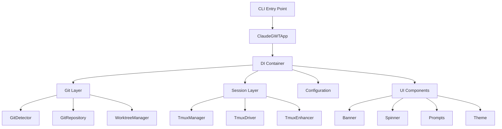
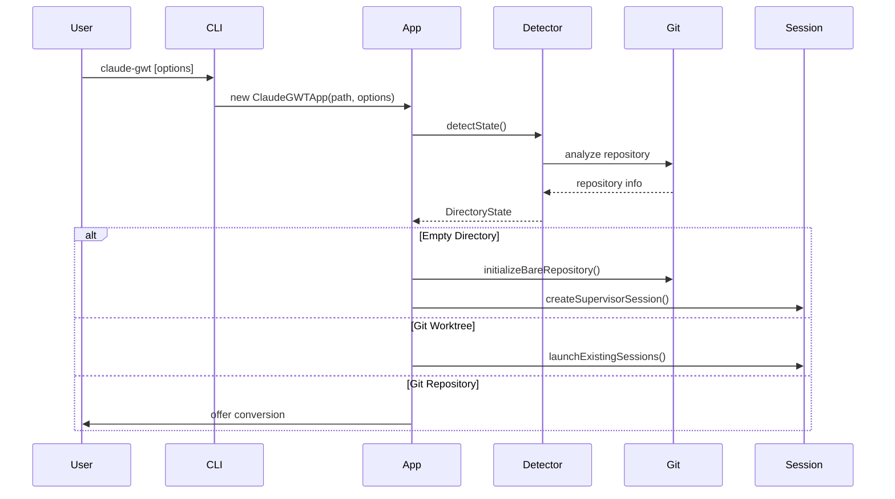
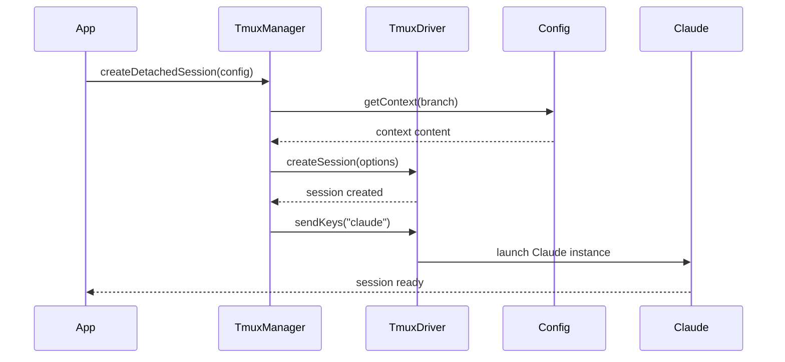

# 🏗️ Claude GWT Architecture

> *A comprehensive guide to understanding the Claude Git Worktree Tool's architecture, design patterns, and internal workings.*

---

## 📋 Table of Contents

- [🎯 Overview](#-overview)
- [🏛️ Core Architecture](#️-core-architecture)
- [📁 Directory Structure](#-directory-structure)
- [🔧 Core Components](#-core-components)
- [🔄 Data Flow](#-data-flow)
- [🎨 Design Patterns](#-design-patterns)
- [🧪 Testing Architecture](#-testing-architecture)
- [🚀 Performance Considerations](#-performance-considerations)
- [🔌 Extension Points](#-extension-points)
- [🐛 Error Handling](#-error-handling)
- [📚 Development Guidelines](#-development-guidelines)

---

## 🎯 Overview

Claude GWT is a sophisticated Git worktree management tool that orchestrates multiple Claude AI instances across different branches. The architecture is designed around clean separation of concerns, dependency injection, and robust error handling.

### Key Architectural Principles

- **🎯 Single Responsibility**: Each component has a clear, focused purpose
- **🔌 Dependency Injection**: Loose coupling through DI container
- **⚡ Async-First**: Built for concurrent operations and performance
- **🛡️ Error Boundaries**: Comprehensive error handling and recovery
- **🧪 Testability**: 100% test coverage with clear testing strategies
- **🔧 Extensibility**: Plugin-ready architecture for future enhancements

---

## 🏛️ Core Architecture



### Architecture Layers

| Layer | Purpose | Components |
|-------|---------|------------|
| **CLI** | User interface and command processing | `cli/index.ts`, `ClaudeGWTApp` |
| **Core** | Business logic and domain services | Git operations, Configuration |
| **Session** | Tmux and Claude orchestration | Session management, Driver abstraction |
| **Infrastructure** | External integrations and utilities | Logging, Security, File operations |

---

## 📁 Directory Structure

```
src/
├── 📁 cli/                    # Command Line Interface
│   ├── 📄 index.ts           # CLI entry point
│   ├── 📄 ClaudeGWTApp.ts    # Main application orchestrator
│   └── 📁 ui/                # User interface components
│       ├── 📄 banner.ts      # Welcome banner
│       ├── 📄 prompts.ts     # Interactive prompts
│       ├── 📄 spinner.ts     # Loading animations
│       └── 📄 theme.ts       # Color and styling
│
├── 📁 core/                   # Core business logic
│   ├── 📁 git/               # Git operations
│   │   ├── 📄 GitDetector.ts # Repository state detection
│   │   ├── 📄 GitRepository.ts # Git operations wrapper
│   │   └── 📄 WorktreeManager.ts # Worktree management
│   │
│   ├── 📁 drivers/           # External system drivers
│   │   └── 📄 TmuxDriver.ts  # Low-level tmux operations
│   │
│   ├── 📁 utils/             # Shared utilities
│   │   ├── 📄 logger.ts      # Structured logging
│   │   ├── 📄 security.ts    # Input sanitization
│   │   └── 📄 validation.ts  # Data validation
│   │
│   ├── 📁 errors/            # Error types and handling
│   │   └── 📄 index.ts       # Custom error classes
│   │
│   └── 📄 ConfigManager.ts   # Configuration management
│
├── 📁 sessions/              # Session orchestration
│   ├── 📄 TmuxManager.ts     # High-level session management
│   └── 📄 TmuxEnhancer.ts    # Advanced tmux features
│
└── 📁 types/                 # TypeScript type definitions
    ├── 📄 index.ts           # Shared types
    ├── 📄 git.ts             # Git-related types
    └── 📄 session.ts         # Session-related types
```

---

## 🔧 Core Components

### 🎭 ClaudeGWTApp - Application Orchestrator

The central coordinator that manages the entire application lifecycle.

```typescript
class ClaudeGWTApp {
  constructor(basePath: string, options: CLIOptions)
  
  // Main application entry point
  async run(): Promise<void>
  
  // Handle different directory states
  private async handleDirectoryState(state: DirectoryState): Promise<void>
  private async handleEmptyDirectory(): Promise<void>
  private async handleGitWorktree(): Promise<void>
  private async handleGitRepository(): Promise<void>
  private async handleNonGitDirectory(): Promise<void>
}
```

**Key Responsibilities:**
- 🎯 Application lifecycle management
- 🔍 Directory state detection and routing
- 🤝 User interaction coordination
- 🚀 Session orchestration

### 🔍 GitDetector - Repository State Intelligence

Intelligently detects and classifies Git repository states.

```typescript
class GitDetector {
  async detectState(): Promise<DirectoryState>
  
  private async checkEmpty(): Promise<boolean>
  private async checkGitWorktree(): Promise<GitWorktreeInfo | null>
  private async checkGitRepository(): Promise<GitRepoInfo | null>
  private async checkClaudeGWTParent(): Promise<boolean>
}
```

**Detection States:**
- 📂 `empty` - Empty directory ready for initialization
- 🌳 `git-worktree` - Existing Git worktree
- 📦 `git-repo` - Regular Git repository
- 🏠 `claude-gwt-parent` - Parent directory of worktrees
- 📁 `non-git` - Non-empty, non-Git directory

### 🌳 WorktreeManager - Branch Orchestration

Manages Git worktree operations with robust error handling.

```typescript
class WorktreeManager {
  async addWorktree(branchName: string, baseBranch?: string): Promise<string>
  async removeWorktree(branchName: string): Promise<void>
  async listWorktrees(): Promise<GitWorktreeInfo[]>
  
  private async validateWorktreeName(name: string): Promise<void>
  private async ensureWorktreeClean(path: string): Promise<void>
}
```

**Features:**
- ✅ Input validation and sanitization
- 🔒 Concurrent operation safety
- 🧹 Automatic cleanup on errors
- 📊 Comprehensive worktree listing

### 🎪 TmuxManager - Session Orchestration

High-level tmux session management with Claude integration.

```typescript
class TmuxManager {
  static async launchSession(config: SessionConfig): Promise<void>
  static async createDetachedSession(config: SessionConfig): Promise<void>
  static async listSessions(): Promise<SessionInfo[]>
  static async shutdownAll(): Promise<void>
  
  // Advanced features
  static createComparisonLayout(session: string, branches: string[], project: string): void
  static toggleSynchronizedPanes(session: string): boolean
}
```

**Session Types:**
- 👑 **Supervisor** - Orchestrates multiple branches
- 👷 **Child** - Individual branch workers
- 🔄 **Comparison** - Side-by-side branch comparison

### 🚗 TmuxDriver - Low-Level Operations

Abstraction layer for tmux command execution.

```typescript
class TmuxDriver {
  static async isAvailable(): Promise<boolean>
  static async createSession(options: CreateSessionOptions): Promise<void>
  static async getSession(name: string): Promise<SessionData | null>
  static async killSession(name: string): Promise<void>
  
  // Advanced operations
  static async createWindow(session: string, name: string, command?: string): Promise<void>
  static async sendKeys(target: string, keys: string): Promise<void>
}
```

---

## 🔄 Data Flow

### Application Startup Flow



### Session Creation Flow



---

## 🎨 Design Patterns

### 🏭 Factory Pattern - Service Creation

```typescript
class ServiceFactory {
  static createGitRepository(path: string): GitRepository {
    return new GitRepository(path);
  }
  
  static createWorktreeManager(basePath: string): WorktreeManager {
    return new WorktreeManager(basePath);
  }
  
  static createTmuxManager(): TmuxManager {
    return new TmuxManager();
  }
}
```

### 🔧 Adapter Pattern - External Integration

```typescript
class TmuxAdapter implements SessionManager {
  constructor(private driver: TmuxDriver) {}
  
  async createSession(config: SessionConfig): Promise<void> {
    return this.driver.createSession(this.adaptConfig(config));
  }
  
  private adaptConfig(config: SessionConfig): TmuxSessionOptions {
    // Transform high-level config to tmux-specific options
  }
}
```

### 🎯 Strategy Pattern - Command Execution

```typescript
interface CommandStrategy {
  execute(context: ExecutionContext): Promise<void>;
}

class GitCloneStrategy implements CommandStrategy {
  async execute(context: ExecutionContext): Promise<void> {
    // Git clone implementation
  }
}

class LocalInitStrategy implements CommandStrategy {
  async execute(context: ExecutionContext): Promise<void> {
    // Local initialization implementation
  }
}
```

### 🔍 Observer Pattern - Event Handling

```typescript
interface SessionObserver {
  onSessionCreated(session: SessionInfo): void;
  onSessionDestroyed(sessionName: string): void;
  onClaudeStarted(sessionName: string): void;
}

class SessionEventEmitter {
  private observers: SessionObserver[] = [];
  
  subscribe(observer: SessionObserver): void {
    this.observers.push(observer);
  }
  
  notifySessionCreated(session: SessionInfo): void {
    this.observers.forEach(o => o.onSessionCreated(session));
  }
}
```

---

## 🧪 Testing Architecture

### Test Organization

```
tests/
├── 📁 unit/                  # Fast, isolated tests
│   ├── 📁 core/             # Core component tests
│   ├── 📁 sessions/         # Session management tests
│   └── 📁 cli/              # CLI component tests
│
└── 📁 integ/                # Integration tests (includes former E2E tests)
    ├── 📄 git-operations.test.ts
    ├── 📄 real-world-workflow.test.ts
    ├── 📄 cli-workflow-integration.test.ts
    ├── 📄 cgwt-command-integration.test.ts
    └── 📄 session-management-integration.test.ts
```

### Testing Strategies

| Test Type | Purpose | Scope | Speed |
|-----------|---------|-------|-------|
| **Unit** | Component behavior | Single functions/classes | ⚡ Fast |
| **Integration** | Component interaction | Multi-component workflows | 🚀 Medium |
| **E2E Local** | Complete workflows | Full application scenarios | 🐌 Slow |

### Mocking Strategy

```typescript
// Service layer mocking
jest.mock('../../../src/core/git/GitRepository');
jest.mock('../../../src/sessions/TmuxManager');

// Driver layer mocking for integration tests
jest.mock('../../../src/core/drivers/TmuxDriver', () => ({
  TmuxDriver: {
    isAvailable: jest.fn().mockResolvedValue(true),
    createSession: jest.fn().mockResolvedValue(undefined),
    // ... other methods
  }
}));
```

---

## 🚀 Performance Considerations

### Async Optimization

```typescript
// Parallel session creation
const sessionPromises = worktrees.map(async (worktree) => {
  const sessionConfig = {
    sessionName: TmuxManager.getSessionName(repoName, worktree.branch),
    workingDirectory: worktree.path,
    branchName: worktree.branch,
    role: 'child',
  };
  
  return TmuxManager.createDetachedSession(sessionConfig);
});

// Wait for all sessions with error isolation
const results = await Promise.allSettled(sessionPromises);
```

### Memory Management

```typescript
class ResourceManager {
  private resources = new WeakMap<object, Disposable>();
  
  register<T extends Disposable>(resource: T): T {
    this.resources.set(resource, resource);
    return resource;
  }
  
  async dispose(): Promise<void> {
    // Cleanup all registered resources
  }
}
```

### Caching Strategy

```typescript
class CachedService<T> {
  private cache = new Map<string, { data: T; timestamp: number }>();
  private readonly TTL = 5 * 60 * 1000; // 5 minutes
  
  async get(key: string, factory: () => Promise<T>): Promise<T> {
    const cached = this.cache.get(key);
    
    if (cached && Date.now() - cached.timestamp < this.TTL) {
      return cached.data;
    }
    
    const data = await factory();
    this.cache.set(key, { data, timestamp: Date.now() });
    return data;
  }
}
```

---

## 🔌 Extension Points

### Plugin Architecture

```typescript
interface ClaudeGWTPlugin {
  name: string;
  version: string;
  
  onAppStart?(app: ClaudeGWTApp): Promise<void>;
  onSessionCreate?(session: SessionConfig): Promise<void>;
  onWorktreeAdd?(worktree: GitWorktreeInfo): Promise<void>;
}

class PluginManager {
  private plugins: ClaudeGWTPlugin[] = [];
  
  register(plugin: ClaudeGWTPlugin): void {
    this.plugins.push(plugin);
  }
  
  async executeHook(hook: string, ...args: any[]): Promise<void> {
    for (const plugin of this.plugins) {
      const method = (plugin as any)[hook];
      if (typeof method === 'function') {
        await method.apply(plugin, args);
      }
    }
  }
}
```

### Custom Commands

```typescript
interface CustomCommand {
  name: string;
  description: string;
  execute(context: CommandContext): Promise<void>;
}

class CommandRegistry {
  private commands = new Map<string, CustomCommand>();
  
  register(command: CustomCommand): void {
    this.commands.set(command.name, command);
  }
  
  async execute(name: string, context: CommandContext): Promise<void> {
    const command = this.commands.get(name);
    if (!command) {
      throw new Error(`Command not found: ${name}`);
    }
    
    await command.execute(context);
  }
}
```

---

## 🐛 Error Handling

### Error Hierarchy

```typescript
class ClaudeGWTError extends Error {
  constructor(
    message: string,
    public readonly code: string,
    public readonly context?: Record<string, any>
  ) {
    super(message);
    this.name = this.constructor.name;
  }
}

class GitOperationError extends ClaudeGWTError {
  constructor(message: string, context?: Record<string, any>) {
    super(message, 'GIT_OPERATION_ERROR', context);
  }
}

class SessionError extends ClaudeGWTError {
  constructor(message: string, context?: Record<string, any>) {
    super(message, 'SESSION_ERROR', context);
  }
}
```

### Error Boundaries

```typescript
class ErrorBoundary {
  static async withBoundary<T>(
    operation: () => Promise<T>,
    recovery?: (error: Error) => Promise<T>
  ): Promise<T> {
    try {
      return await operation();
    } catch (error) {
      Logger.error('Operation failed', error);
      
      if (recovery) {
        return recovery(error);
      }
      
      throw error;
    }
  }
}

// Usage
const result = await ErrorBoundary.withBoundary(
  () => gitRepo.clone(url),
  async (error) => {
    // Fallback to local initialization
    return gitRepo.init();
  }
);
```

### Graceful Degradation

```typescript
class FeatureDetector {
  static async checkTmuxAvailability(): Promise<boolean> {
    try {
      return await TmuxDriver.isAvailable();
    } catch {
      return false;
    }
  }
  
  static async checkGitAvailability(): Promise<boolean> {
    try {
      await GitRepository.checkGitInstallation();
      return true;
    } catch {
      return false;
    }
  }
}
```

---

## 📚 Development Guidelines

### Code Style

```typescript
// ✅ Good: Clear, descriptive naming
class GitWorktreeManager {
  async createWorktreeForBranch(branchName: string): Promise<string> {
    const sanitizedName = this.sanitizeBranchName(branchName);
    const worktreePath = path.join(this.basePath, sanitizedName);
    
    await this.validateWorktreeCreation(worktreePath);
    return this.executeWorktreeCreation(sanitizedName, worktreePath);
  }
}

// ❌ Bad: Unclear, abbreviated naming
class WtMgr {
  async create(name: string): Promise<string> {
    const p = path.join(this.base, name);
    return this.exec(name, p);
  }
}
```

### Async Patterns

```typescript
// ✅ Good: Proper error handling and timeout
async function safeAsyncOperation<T>(
  operation: () => Promise<T>,
  timeoutMs: number = 30000
): Promise<T> {
  return Promise.race([
    operation(),
    new Promise<never>((_, reject) => 
      setTimeout(() => reject(new Error('Operation timeout')), timeoutMs)
    )
  ]);
}

// ✅ Good: Concurrent operations with error isolation
async function createMultipleSessions(configs: SessionConfig[]): Promise<void> {
  const results = await Promise.allSettled(
    configs.map(config => TmuxManager.createDetachedSession(config))
  );
  
  const failures = results
    .filter((result): result is PromiseRejectedResult => result.status === 'rejected')
    .map(result => result.reason);
    
  if (failures.length > 0) {
    Logger.warn(`${failures.length} sessions failed to create`, { failures });
  }
}
```

### Type Safety

```typescript
// ✅ Good: Strict typing with branded types
type BranchName = string & { readonly __brand: unique symbol };
type SessionName = string & { readonly __brand: unique symbol };

function createBranchName(name: string): BranchName {
  if (!isValidBranchName(name)) {
    throw new Error(`Invalid branch name: ${name}`);
  }
  return name as BranchName;
}

// ✅ Good: Discriminated unions for state management
type DirectoryState = 
  | { type: 'empty'; path: string }
  | { type: 'git-worktree'; path: string; gitInfo: GitWorktreeInfo }
  | { type: 'git-repo'; path: string; gitInfo: GitRepoInfo }
  | { type: 'claude-gwt-parent'; path: string; worktrees: GitWorktreeInfo[] }
  | { type: 'non-git'; path: string; contents: string[] };
```

### Testing Guidelines

```typescript
// ✅ Good: Descriptive test structure
describe('WorktreeManager', () => {
  describe('createWorktree', () => {
    it('should create worktree with valid branch name', async () => {
      // Arrange
      const manager = new WorktreeManager('/test/path');
      const branchName = 'feature/new-auth';
      
      // Act
      const result = await manager.addWorktree(branchName);
      
      // Assert
      expect(result).toBe('/test/path/feature-new-auth');
      expect(mockGitCommand).toHaveBeenCalledWith([
        'worktree', 'add', '/test/path/feature-new-auth', 'feature/new-auth'
      ]);
    });
    
    it('should sanitize invalid characters in branch names', async () => {
      // Test specific edge case with clear expectation
    });
    
    it('should handle concurrent worktree creation gracefully', async () => {
      // Test race condition scenarios
    });
  });
});
```

---

## 🎯 Key Takeaways

1. **🏗️ Modular Design** - Each component has a single, well-defined responsibility
2. **🔧 Dependency Injection** - Loose coupling enables testing and extensibility  
3. **⚡ Async-First** - Built for concurrent operations and responsiveness
4. **🛡️ Robust Error Handling** - Comprehensive error boundaries and recovery
5. **🧪 Testing Excellence** - 100% coverage with clear testing strategies
6. **🚀 Performance Focused** - Optimized for real-world usage patterns
7. **🔌 Extensible** - Plugin architecture for future enhancements

This architecture provides a solid foundation for building reliable, maintainable, and extensible developer tools while maintaining excellent performance and user experience.

---

*For questions about the architecture or contributions, please refer to our [Contributing Guide](CONTRIBUTING.md) or open an issue.*